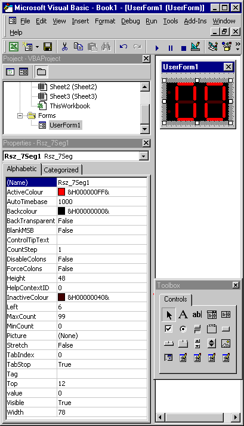



## Resizable 7 Segment Display\!

### Description

It's a comsmetic item really. Why display numbers using a large font when you can have a 'Real'. LED display!!, it can be resized at runtime an was designed to be daisy chained together to form a display 'Bank'
 
### More Info
 
Number To Display (Integer)

Autoincrement Interval (Integer)

Manual Trigger (Method)

Reset (Method)

Carry In (Integer)

Auto / Manual mode (Property)

Maxcount (Integer)

Mincount (Integer)

Colons On / Off (Property)

etc.

etc.

I always try to think how people are going to use my code and error trap accordingly. If you find my code qwerky then pleez let me know. As i've had NO official training my methods and style may not be what you are used to.

Carry Out (Integer)

Displayed Number (Integer)

Overflow (Event)

Underflow (Event)

Colons Change State (Event)

None I am aware of

Please let me know if you find any.

             |
---                |---
**Submitted On**   |2000-09-23 22:07:40
**By**             |[Don Balmer](https://github.com/Planet-Source-Code/PSCIndex/blob/master/ByAuthor/don-balmer.md)
**Level**          |Advanced
**User Rating**    |4.9 (88 globes from 18 users)
**Compatibility**  |VB 4\.0 \(32\-bit\), VB 5\.0, VB 6\.0
**Category**       |[OLE/ COM/ DCOM/ Active\-X](https://github.com/Planet-Source-Code/PSCIndex/blob/master/ByCategory/ole-com-dcom-active-x__1-29.md)
**World**          |[Visual Basic](https://github.com/Planet-Source-Code/PSCIndex/blob/master/ByWorld/visual-basic.md)
**Archive File**   |[CODE\_UPLOAD1068410152000\.zip](https://github.com/Planet-Source-Code/don-balmer-resizable-7-segment-display__1-12081/archive/master.zip)

